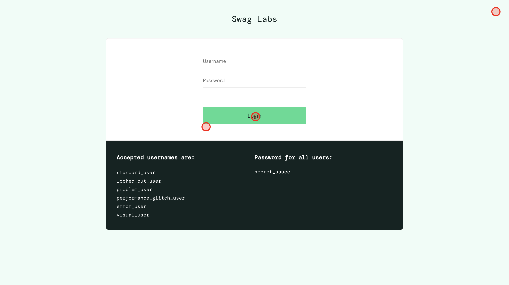

# AAA Life SDET Technical Assessment

This project contains a small automated test suite for the AAA Life SDET take-home assessment.

The implementation covers two areas:

- API tests for Restful Booker
- UI smoke test for Sauce Demo

The goal was to keep the scope focused, readable, and close to a realistic 4-hour assessment, while still showing basic framework structure and maintainability.

## Tech stack

- Java 17
- Maven
- TestNG
- REST Assured
- JSON Schema Validator
- Jackson
- Selenium 4
- WebDriverManager
- AssertJ

## Targets

API target:

https://restful-booker.herokuapp.com

UI target:

https://www.saucedemo.com

## Prerequisites

Before running the tests, make sure the following are available:

- Java 17 or later
- Chrome browser
- Internet connection
- Maven wrapper from this project

You do not need to install Maven separately if you use the Maven wrapper.

Check Java:

```bash
java -version
```

Expected result: Java 17 or later.

## Project structure

```text
src/test/java/com/viktor/aaalife
  setup
    api
      v1
        base
        client
        models
        utils
    config
    ui
      base
      driver
      listeners
      pages
      utils
  tests
    api
      v1
        auth
        booking
        contract
        ping
    ui

src/test/resources
  config.properties
  suites
    all.xml
    api.xml
    ui.xml
  testdata
    api
      v1
        schemas
        booking.json
        invalid-bookings.json
```

## How to run all tests

Mac or Linux:

```bash
./mvnw clean test
```

Windows:

```powershell
.\mvnw.cmd clean test
```

## How to run API tests only

Mac or Linux:

```bash
./mvnw test -Dsurefire.suiteXmlFiles=src/test/resources/suites/api.xml
```

Windows:

```powershell
.\mvnw.cmd test -Dsurefire.suiteXmlFiles=src/test/resources/suites/api.xml
```

## How to run UI tests only

Mac or Linux:

```bash
./mvnw test -Dsurefire.suiteXmlFiles=src/test/resources/suites/ui.xml
```

Windows:

```powershell
.\mvnw.cmd test -Dsurefire.suiteXmlFiles=src/test/resources/suites/ui.xml
```

## Configuration

Default configuration is stored in:

```text
src/test/resources/config.properties
```

The main values are:

```properties
api.base.uri=https://restful-booker.herokuapp.com
ui.base.url=https://www.saucedemo.com
ui.browser=chrome
ui.headless=false
sauce.username=standard_user
sauce.password=secret_sauce
```

The property reader supports overrides from system properties and environment variables. This makes it possible to run against a different target without changing code.

Example:

```bash
./mvnw clean test -Dui.headless=true
```

## API test coverage

The API suite focuses on the Restful Booker API.

The main covered endpoints are:

- POST /booking
- GET /booking
- GET /booking/{id}
- PUT /booking/{id}
- PATCH /booking/{id}
- DELETE /booking/{id}
- POST /auth
- GET /ping

For the assessment requirement, the primary coverage is built around at least three endpoints:

- Create booking
- Get booking by ID
- Delete booking

The suite includes:

- Positive scenarios
- Negative scenarios
- Unhappy paths
- Boundary values
- Contract validation with JSON Schema
- Test data loaded from external JSON files

Examples of API coverage:

- Create booking with valid payload
- Create booking with invalid payload
- Create booking with boundary values
- Get booking by valid ID
- Get booking with invalid or boundary ID values
- Delete existing booking
- Delete booking with invalid or missing token
- Validate response contracts using JSON Schema

## UI test coverage

The UI suite covers a short happy-path smoke flow for Sauce Demo.

Flow:

1. Open Sauce Demo
2. Log in as standard user
3. Add Sauce Labs Backpack to the cart
4. Open the cart
5. Verify the selected item is present

The UI implementation includes Page Objects for:

- Login page
- Inventory page
- Cart page

The UI framework uses:

- Explicit waits
- Stable locators such as id and data-test attributes
- No Thread.sleep calls
- Lazy WebDriver creation
- BrowserFactory for browser setup
- DriverManager with ThreadLocal driver storage
- TestNG listener for failure artifacts

## Failure artifacts

For UI failures, the framework captures diagnostic artifacts automatically.

Failure artifacts are saved under:

```text
target/failure-artifacts
```

The captured files include:

- Screenshot
- HTML page dump

These files are created only when a UI test fails.

## Test reports and local run output

When tests are run with Maven, reports are generated under:

```text
target/surefire-reports
```

Useful report files:

```text
target/surefire-reports/emailable-report.html
target/surefire-reports/testng-results.xml
```

A sample local run output can also be included in the final submission zip under:
```text
[emailable-execution-report.html](emailable-execution-report.html)
[sauceDemo_loginAndAddBackpackToCart_cartContainsSelectedItem-1779291608337.html](failure-artifacts/sauceDemo_loginAndAddBackpackToCart_cartContainsSelectedItem-1779291608337.html)

```

## Current note about Restful Booker availability

During local testing, the public Restful Booker API intermittently returned:

```text
HTTP 418 I'm a teapot
```

for valid POST /booking requests.

I left the positive contract tests strict against the documented API behavior instead of making them pass on HTTP 418. If POST /booking returns 418, the tests correctly fail because the API is not honoring the expected create-booking contract at that moment.
This is noted as an external target stability issue, not as an expected application behavior.

## Decision Log

### Scope interpretation and timeboxing

I interpreted the task as a focused API and UI automation assessment, not as a full enterprise test framework.

The implementation was kept intentionally small:

- API tests cover the main Restful Booker flows needed for the requirement
- UI test covers one realistic Sauce Demo smoke journey
- Framework utilities were added only where they improve readability, stability, or diagnostics

I avoided adding unnecessary tools such as video recording, retry analyzers, Selenium Grid, or complex custom annotations because they would be too much for this assessment scope.

### Test selection and coverage rationale

For API testing, I focused on booking-related endpoints because they allow meaningful CRUD-style coverage:

- Create a booking
- Retrieve a booking
- Update a booking
- Delete a booking

This gives coverage for positive flows, negative flows, boundary data, and response contracts.
For UI testing, I selected the Sauce Demo login and add-to-cart flow because it is a clear e-commerce smoke scenario. It validates that a user can log in, interact with inventory, and verify the cart state.

### Stability and data strategies

- API test data is externalized into JSON files where it makes sense. This keeps the tests easier to maintain and avoids burying all test data inside Java code.
- Response contracts are validated with JSON Schema. This helps verify not only status codes, but also response structure and data types.
- The UI tests use explicit waits and stable locators. No fixed sleeps are used.
- Failure artifacts are captured only on UI failure to keep normal test runs clean while still providing useful debugging evidence when something breaks.

### Project structure decisions

The project separates setup code from test code.

API setup includes:
- API client
- Models
- Data providers
- Schema validation helpers

UI setup includes:
- BrowserFactory
- DriverManager
- BasePage
- Page Objects
- Failure artifact listener

The UI driver is created lazily and stored in ThreadLocal. This keeps driver lifecycle centralized and leaves room for future parallel execution if needed.
The Page Objects expose user-level actions instead of raw Selenium calls inside tests. This keeps the test method readable and closer to business behavior.

### Next steps if given more time

If I had more time, I would consider the following improvements:
- Add richer reporting, such as Allure
- Add a small retry strategy only for known external infrastructure instability
- Add RemoteWebDriver support for Selenium Grid
- Add tested Firefox support
- Add CI workflow with separate API and UI jobs
- Add more detailed negative API contract tests
- Add more UI checks around checkout flow
- Add tagging or groups for smoke, regression, and contract tests
- Add integration with a test management or test operations dashboard
